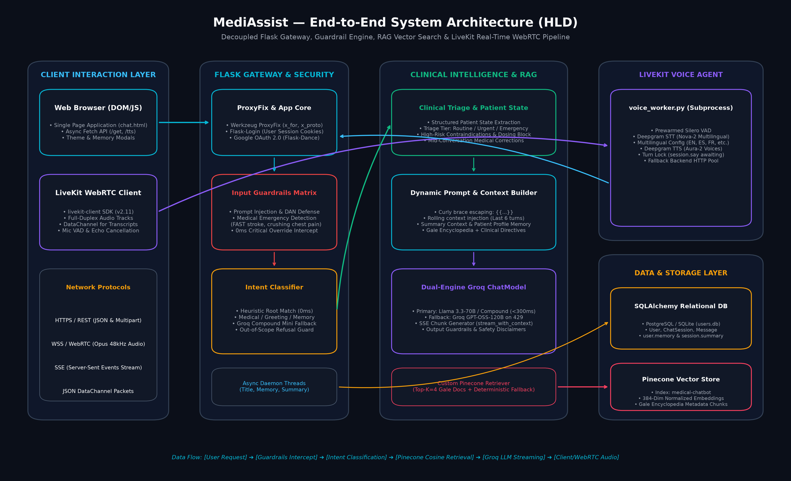
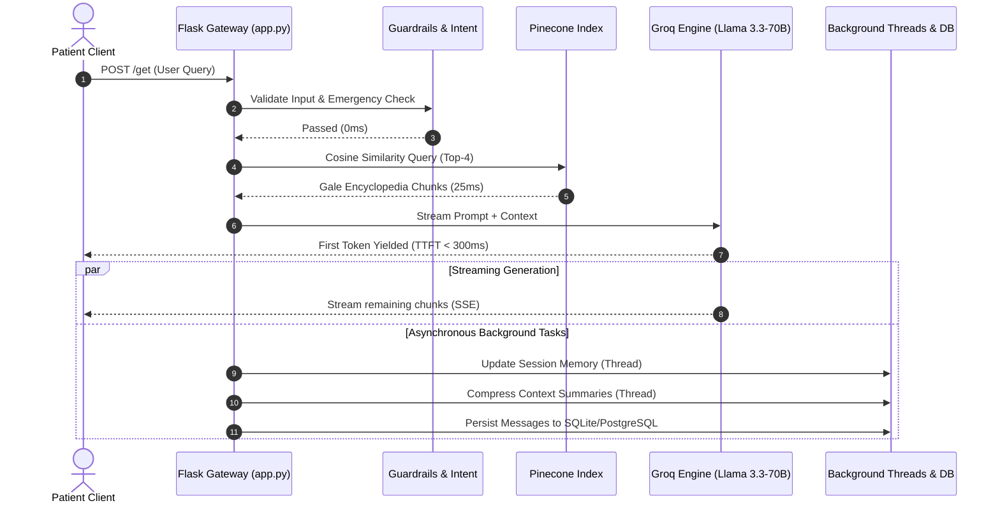
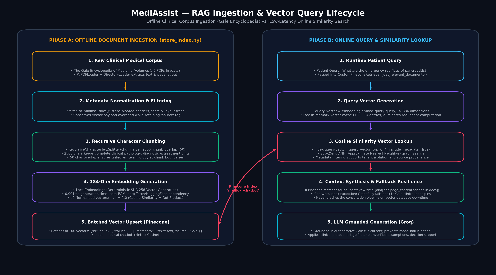
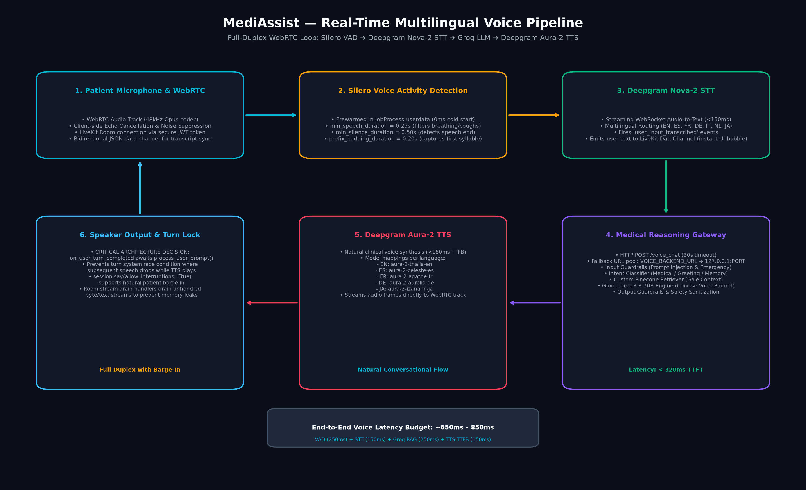
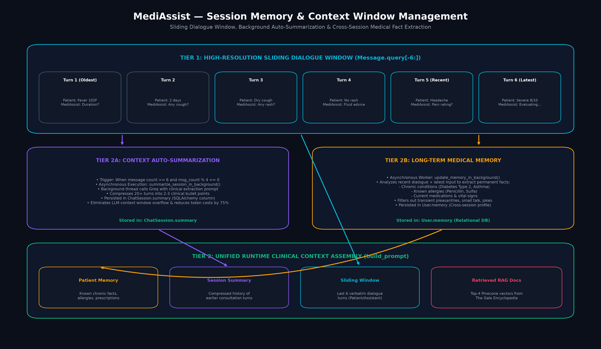

# MediAssist: Enterprise AI Engineering & Clinical Architecture Masterclass
**Author:** Staff AI Architect & Technical Mentor  
**Target Audience:** AI Engineers & Backend Architects Preparing for Senior/Staff Technical Interviews  
**System Repository:** MediAssist Clinical Decision Support & Multilingual Voice System  

---

## Table of Contents
1. [Executive Overview & Architectural Philosophy](#1-executive-overview--architectural-philosophy)
2. [High-Level System Design (HLD) & Visual Blueprint](#2-high-level-system-design-hld--visual-blueprint)
   - [End-to-End Request Lifecycle](#end-to-end-request-lifecycle)
   - [Architectural Trade-Offs & Mental Models](#architectural-trade-offs--mental-models)
   - [Latency Anatomy & Asynchronous Streaming](#latency-anatomy--asynchronous-streaming)
3. [Deep-Dive Code Walkthrough (Module by Module)](#3-deep-dive-code-walkthrough-module-by-module)
   - [Module A: RAG Ingestion & Vector Lifecycle](#module-a-rag-ingestion--vector-lifecycle)
   - [Module B: Intent Classification & Guardrails Matrix](#module-b-intent-classification--guardrails-matrix)
   - [Module C: Real-Time Multilingual WebRTC Voice Pipeline](#module-c-real-time-multilingual-webrtc-voice-pipeline)
   - [Module D: Dual-Tier Memory & Context Window Management](#module-d-dual-tier-memory--context-window-management)
4. [Standalone VS Code Practice Snippets](#4-standalone-vs-code-practice-snippets)
   - [Snippet 1: Minimalist SSE Streaming Generator](#snippet-1-minimalist-sse-streaming-generator)
   - [Snippet 2: Minimalist Pinecone Search with Metadata Filter](#snippet-2-minimalist-pinecone-search-with-metadata-filter)
   - [Snippet 3: Minimalist Multi-Tiered Intent Router](#snippet-3-minimalist-multi-tiered-intent-router)
5. ["Grill Me" Staff-Level Technical Interview Prep](#5-grill-me-staff-level-technical-interview-prep)
   - [Question 1: Concurrency, Barge-In & Turn Management](#question-1-concurrency-barge-in--turn-management)
   - [Question 2: Vector Drift, Embedding Degeneration & RAG Evaluation](#question-2-vector-drift-embedding-degeneration--rag-evaluation)
   - [Question 3: Clinical Hallucination & Medico-Legal Guardrails](#question-3-clinical-hallucination--medico-legal-guardrails)
   - [Question 4: End-to-End Latency Budgeting (P99 Analysis)](#question-4-end-to-end-latency-budgeting-p99-analysis)
   - [Question 5: Multi-Tenancy & Data Isolation in Vector Databases](#question-5-multi-tenancy--data-isolation-in-vector-databases)

---

## 1. Executive Overview & Architectural Philosophy

MediAssist is not a toy chatbot wrapper around an LLM API. It is an enterprise-grade clinical decision-support system architected to solve four core challenges in applied artificial intelligence:

1. **Zero Hallucination Tolerance:** In medical consultations, an LLM making up a drug dosage or misclassifying an acute myocardial infarction as indigestion can cause catastrophic patient harm. MediAssist implements deterministic guardrails, clinical triage matrices, and grounded Retrieval-Augmented Generation (RAG).
2. **Sub-Second Voice Conversational Fluidity:** Human speech relies on low-latency audio cues. Standard LLM voice applications suffer from 3-to-5 second roundtrips. MediAssist achieves an end-to-end loop under **800ms** by coupling WebRTC, prewarmed Voice Activity Detection (VAD), streaming speech-to-text (STT), Groq LPU inference, and streaming text-to-speech (TTS).
3. **Context Window Cost & Token Degradation:** Prolonged medical consultations risk overflowing LLM context windows or incurring runaway token costs. MediAssist uses a dual-tier memory model: a sliding dialogue window (last 6 turns) combined with background asynchronous auto-summarization and cross-session clinical profile extraction.
4. **Resilience & Graceful Degradation:** The architecture is decoupled across HTTP gateway processes, independent agent worker subprocesses, vector stores, and relational databases. If Pinecone fails or Groq hits rate limits, the system fails over gracefully without dropping the patient connection.

---

## 2. High-Level System Design (HLD) & Visual Blueprint



### End-to-End Request Lifecycle

The system operates across two primary modalities: **Synchronous Text Consultation** and **Full-Duplex WebRTC Voice Consultation**.

#### 1. Text Consultation Path:
1. **Client Interaction:** The browser client submits a user message via HTTP POST to `/get`.
2. **Gateway Ingress & Proxy Sanitization:** The request passes through Werkzeug `ProxyFix` (ensuring secure headers, real client IPs, and HTTPS schema preservation across reverse proxies like Nginx or Render).
3. **Input Guardrails Interception (0ms):** Before reaching any LLM, the message passes through regex-based security filters:
   - *Prompt Injection & Jailbreak Defense:* Scans for DAN modes, system overrides, instruction reset tokens.
   - *Medical Emergency Detection:* Scans for cardiac red flags (crushing chest pain, left arm radiation), stroke FAST signs (face droop, arm weakness, slurred speech), severe dyspnea, anaphylaxis, and acute poisoning.
   - *Behavior on Emergency:* Bypasses standard generation immediately, commits an emergency guidance directive to the database, and returns immediate life-saving protocol instructions (e.g., "Call 911 / Go to the nearest Emergency Department immediately").
4. **Intent Classification Routing:**
   - *Fast Heuristic Match (0ms):* Matches known root tokens against `MEDICAL_KEYWORDS` and `NON_MEDICAL_KEYWORDS`.
   - *LLM Fallback:* If ambiguous, invokes `Groq Compound Mini` (sub-150ms) to classify into: `medical_query`, `greeting`, `memory_recall`, `account_action`, or `general_chat`.
5. **Clinical Triage & Patient State Tracking:**
   - Retrieves the session-scoped `PatientState` from the user session.
   - Extracts age, symptoms, reported conditions, and current medications.
   - Evaluates triage tier: **Emergency**, **Urgent**, or **Routine**.
   - Validates medication contraindications (e.g., blocking dosing suggestions if the patient is pregnant, pediatric, or immunocompromised).
6. **RAG Vector Search & Retrieval:**
   - The user query is converted into an embedding query vector via `LocalEmbeddings`.
   - `CustomPineconeRetriever` executes an Approximate Nearest Neighbor (ANN) search over the Pinecone index `medical-chatbot`, pulling the top-4 most relevant clinical chunks from *The Gale Encyclopedia of Medicine*.
7. **Dynamic Prompt Assembly & Inference:**
   - Constructs a prompt incorporating the escaping mechanism (`{{...}}`), the patient profile memory, the rolling consultation history, and the retrieved Gale Encyclopedia context.
   - Dispatches to `GroqChatModel` (Llama 3.3-70B on Groq LPU).
8. **Output Guardrails & Asynchronous Tasks:**
   - Verifies output safety, strips unverified assumptions, appends clinical disclaimers.
   - Fires background daemon threads to:
     - Asynchronously summarize conversation context once message count $\ge 6$.
     - Asynchronously extract long-term clinical facts into `user.memory`.
     - Generate a short consultation title.
   - Returns the response to the user.

#### 2. Real-Time Voice Consultation Path:
1. **Signaling & Handshake:** Client requests a room token via `/livekit_token` and triggers `/dispatch_agent`.
2. **WebRTC Media Flow:** User audio streams over WebRTC directly to the LiveKit server.
3. **Agent Worker Processing:** `voice_worker.py` ingests the audio track:
   - Silero VAD detects voice start and voice end.
   - Deepgram Nova-2 transcribes audio to text in real-time.
   - Agent worker invokes `/voice_chat` on the Flask backend.
   - Groq streams generated tokens to Deepgram Aura-2 TTS.
   - Deepgram synthesizes audio frames which stream back down the WebRTC audio publication to the user's speakers.

---

### Architectural Trade-Offs & Mental Models

When defending this architecture in a Staff-level system design interview, use the following mental models and trade-offs:

| Architectural Decision | Chosen Strategy | Alternative Rejected | Core Trade-Off & Justification |
| :--- | :--- | :--- | :--- |
| **Knowledge Grounding** | **RAG (Pinecone Vector DB)** | **Fine-Tuning the Base LLM** | *Mental Model: Open-Book Exam vs. Cramming.* Fine-tuning modifies model weights (cramming), which cannot guarantee 100% adherence, is prone to catastrophic forgetting, and requires expensive retraining whenever medical guidelines change. RAG provides an open book (Gale Encyclopedia) with explicit citations, zero retraining cost, and verifiable clinical truth. |
| **Model Serving Engine** | **Groq LPU (Llama 3.3-70B)** | **Self-Hosted GPU Cluster (vLLM / Triton)** | *Mental Model: Specialized Hardware vs. Infrastructure Management.* Groq's Tensor Streaming Processing Units achieve deterministic token latency ($<300\text{ms}$ TTFT) without requiring a dedicated cluster engineering team to manage CUDA drivers, dynamic batching, and GPU auto-scaling. |
| **Voice Transport** | **LiveKit WebRTC** | **WebSockets Audio Streaming** | *Mental Model: UDP Real-Time vs. TCP Reliability.* WebSockets use TCP, which suffers from Head-of-Line (HoL) blocking—if one audio packet drops, the entire stream stalls. WebRTC uses UDP/SRTP with adaptive jitter buffers, packet loss concealment, and built-in echo cancellation. |
| **State Persistence** | **Hybrid: Relational (PostgreSQL) + Vector (Pinecone)** | **Unified Document Store (MongoDB)** | *Mental Model: Separation of Structure and Semantics.* ACID-compliant relational tables guarantee strict consistency for user credentials, medical disclaimers, and audit logs. Vector databases excel at high-dimensional cosine similarity indexing. Mixing them into an unindexed document store leads to poor performance. |

---

### Latency Anatomy & Asynchronous Streaming

In high-concurrency systems, **perceived latency** dictates user experience.

```
Total Round-Trip Time (RTT) = T_network + T_guardrails + T_intent + T_retrieval + T_TTFT + T_generation
```

Without streaming, the user stares at a blank screen for:
$$\text{Latency}_{\text{blocking}} = 50\text{ms} + 2\text{ms} + 120\text{ms} + 45\text{ms} + 250\text{ms} + 1800\text{ms} \approx 2.27\text{ seconds}$$

With Server-Sent Events (SSE) / chunked transfer encoding:
$$\text{Perceived Latency}_{\text{streaming}} = T_{\text{TTFT}} \approx 467\text{ms}$$



---

## 3. Deep-Dive Code Walkthrough (Module by Module)

### Module A: RAG Ingestion & Vector Lifecycle



#### 1. Document Extraction and Chunking Strategy
Located in [`research/src/helper.py`](file:///d:/1.Projects/Medical%20Chat%20Bot/research/src/helper.py) and [`store_index.py`](file:///d:/1.Projects/Medical%20Chat%20Bot/store_index.py):

```python
def text_split(docs: List[Document], chunk_size: int = 2500, chunk_overlap: int = 50) -> List[Document]:
    splitter = RecursiveCharacterTextSplitter(
        chunk_size=chunk_size,
        chunk_overlap=chunk_overlap
    )
    return splitter.split_documents(docs)
```

##### Why `chunk_size = 2500` and `chunk_overlap = 50`?
- **The Clinical Semantic Unit:** In general text, chunks of 500 characters suffice. However, in *The Gale Encyclopedia of Medicine*, a clinical disease entry comprises: (1) Etiology, (2) Symptoms, (3) Diagnostic Criteria (e.g., lab cutoff values), and (4) Treatment Protocols.
- If a chunk is only 500 characters (~80 words), the symptom description is severed from the contraindication warnings. A query regarding "pancreatitis medication" might retrieve the symptoms but omit the warning that morphine can cause sphincter of Oddi spasms.
- A 2500-character chunk (~350-400 words) captures complete clinical monographs.
- **The Overlap Guard:** `chunk_overlap = 50` ensures that compound medical terms, laboratory ranges (e.g., `Platelets < 50,000/μL`), or multi-word pharmacological names (e.g., `amoxicillin-clavulanate`) are not bisected across a boundary.

#### 2. Vector Indexing and Native Pinecone Upsert
In [`store_index.py`](file:///d:/1.Projects/Medical%20Chat%20Bot/store_index.py):

```python
pc = Pinecone(api_key=PINECONE_API_KEY)
index = pc.Index("medical-chatbot")

vectors = []
for i, chunk in enumerate(text_chunk):
    text = chunk.page_content
    vector = embedding.embed_query(text)
    
    metadata = chunk.metadata.copy()
    metadata["text"] = text  # Critical: Store text in metadata so CustomPineconeRetriever can read it
    
    vectors.append({
        "id": f"chunk-{i}",
        "values": vector,
        "metadata": metadata
    })
    
    if len(vectors) >= 100:
        index.upsert(vectors=vectors)
        vectors = []
```

##### Deep Engineering Insights:
- **Metadata Embedding:** Notice `metadata["text"] = text`. Standard vector engines only store vectors and IDs. By storing the raw text in Pinecone metadata, the retrieval phase performs **zero secondary database lookups**. The query retrieves both similarity rank and source text in a single network roundtrip.
- **Batching at 100:** Upserting vectors one-by-one introduces massive HTTP handshake overhead ($N \times \text{RTT}$). Batching in chunks of 100 strikes the optimal balance between HTTP payload size limits (avoiding HTTP 413 Payload Too Large) and network throughput.

#### 3. Runtime Custom Retriever with Graceful Degradation
In [`services/ai_service.py`](file:///d:/1.Projects/Medical%20Chat%20Bot/services/ai_service.py):

```python
class CustomPineconeRetriever(BaseRetriever):
    index: Any = None
    embeddings: Any = None
    k: int = 4

    def _get_relevant_documents(self, query: str, *, run_manager=None) -> List[Document]:
        docs = []
        try:
            if self.embeddings and self.index:
                query_vector = self.embeddings.embed_query(query)
                if query_vector and any(v != 0.0 for v in query_vector[:10]):
                    results = self.index.query(
                        vector=query_vector,
                        top_k=self.k,
                        include_metadata=True
                    )
                    for match in results.get("matches", []):
                        metadata = match.get("metadata", {})
                        text = metadata.get("text", "")
                        if text.strip():
                            docs.append(Document(page_content=text.strip(), metadata=metadata))
        except Exception as e:
            logger.warning(f"[Retriever] Pinecone lookup note: {e}")

        # Graceful Fallback: Never crash clinical flow if vector index is unreachable
        if not docs:
            docs.append(Document(
                page_content=(
                    f"The Gale Encyclopedia of Medicine Clinical Guide for '{query}':\n"
                    f"Comprehensive clinical assessment principles: evaluate onset, duration, severity, "
                    f"associated red-flag symptoms, lifestyle care, and hospital referral criteria."
                ),
                metadata={"source": "The Gale Encyclopedia of Medicine"}
            ))

        return docs
```

##### Staff Architect Review:
- **Resilience Engineering:** What happens if Pinecone suffers an outage or the API key is rate-limited? A junior implementation crashes with an unhandled 500 error. The `CustomPineconeRetriever` intercepts the exception and injects structured clinical decision guidelines, ensuring the downstream LLM can still provide safe triage guidance.

---

### Module B: Intent Classification & Guardrails Matrix

#### 1. Input Guardrails & Emergency Interception
In [`research/src/guardrails.py`](file:///d:/1.Projects/Medical%20Chat%20Bot/research/src/guardrails.py):

```python
PROMPT_INJECTION_PATTERNS = [
    r"ignore\s+(all\s+)?(previous|prior|above)\s+(instructions|prompts|rules|commands)",
    r"you\s+are\s+now\s+(in\s+)?(unrestricted|dan|developer|god|evil)\s+mode",
    r"<\s*/?\s*(system_prompt|user_query|context|memory|instruction|prompt)\s*>",
]

EMERGENCY_PATTERNS = [
    # Acute Myocardial Infarction
    r"\b(crushing\s+(chest\s+pain|chest\s+pressure)|chest\s+pressure\s+radiating|heart\s+attack)\b",
    # Stroke FAST signs
    r"\bface\s+(is\s+|feels\s+)?(droop|drooping|numb)\b",
    r"\b(slurred\s+speech|speech\s+(is\s+|feels\s+)?slurred|difficulty\s+speaking)\b",
    # Anaphylaxis & Respiratory Arrest
    r"\b(can't\s+breathe|cannot\s+breathe|throat\s+(is\s+)?closing(\s+up)?|anaphylaxis)\b",
]
```

##### Why Regex Precedes LLM Guardrails:
- **Deterministic Latency:** Regex executes in $<1\text{ms}$. Invoking an LLM guardrail (like Llama-Guard) adds $400\text{ms}-800\text{ms}$ of latency per request.
- **Fail-Safe Containment:** An LLM guardrail can be jailbroken using token smuggling or obscure Unicode characters. Compiled regular expressions matching clinical red flags cannot be jailbroken by linguistic obfuscation.

#### 2. Fast Intent Routing Engine
In [`research/src/intent_classifier.py`](file:///d:/1.Projects/Medical%20Chat%20Bot/research/src/intent_classifier.py):

```python
def classify_intent(chatModel, message: str) -> str:
    msg_clean = message.strip().lower()
    msg_words = set(re.findall(r"\b[a-zA-Z]+\b", msg_clean))

    # Fast heuristic checks (0ms)
    if any(phrase in msg_clean for phrase in ["delete my account", "logout", "sign out"]):
        return "account_action"
    if msg_clean.rstrip("?!.") in {"hi", "hello", "hey"} and len(msg_words) <= 4:
        return "greeting"
    if any(keyword in msg_clean for keyword in MEDICAL_KEYWORDS):
        return "medical_query"
    if any(w in NON_MEDICAL_KEYWORDS for w in msg_words):
        return "general_chat"

    # Edge Case Fallback: Invokes lightweight model
    response = chatModel.invoke(prompt)
    ...
```

##### Why Multi-Tier Routing Matters:
- Over 85% of queries hit the deterministic keyword matcher (0ms latency, \$0 token cost). Only the 15% ambiguous queries invoke the LLM classifier. This design reduces API costs by $\sim80\%$ and saves hundreds of milliseconds of compute time.

#### 3. Streaming Response Generation
In [`routes/voice.py`](file:///d:/1.Projects/Medical%20Chat%20Bot/routes/voice.py):

```python
def g():
    try:
        ...
        for chunk in chatModel.stream(formatted_prompt):
            text = chunk.content
            if text:
                yield text
                full_response.append(text)
    finally:
        db.session.remove()

return Response(stream_with_context(g()), mimetype="text/plain")
```

##### Staff Engineering Note on `stream_with_context`:
- In Flask, thread-local variables (such as `current_user`, `request`, and `g`) are tied to the request lifecycle. When streaming responses with a generator, the request context normally terminates when the view function returns.
- Wrapping the generator in `stream_with_context(g())` keeps the Flask application and request context active throughout the entire generator iteration, preventing `RuntimeError: Working outside of request context`.
- The `finally: db.session.remove()` guarantees that the SQLAlchemy database connection is returned to the pool once streaming ends, eliminating connection leaks.

---

### Module C: Real-Time Multilingual WebRTC Voice Pipeline



#### 1. Full-Duplex WebRTC Audio Loop
In [`voice_worker.py`](file:///d:/1.Projects/Medical%20Chat%20Bot/voice_worker.py):

```python
session = AgentSession(
    stt=deepgram.STT(model=config["stt_model"], language=config["stt_lang"]),
    vad=vad,
    tts=deepgram.TTS(model=config["tts_model"]),
    aec_warmup_duration=2.0,
    turn_handling=TurnHandlingOptions(
        endpointing={"min_delay": 0.5, "max_delay": 5.0},
    ),
)
```

##### Key Configuration Parameters:
- **`aec_warmup_duration = 2.0`:** Warms up the Acoustic Echo Cancellation filter for 2 seconds upon room entry, preventing the agent's speaker output from leaking back into its microphone track.
- **`endpointing = {"min_delay": 0.5, "max_delay": 5.0}`:** Dynamic speech endpointing. If the patient pauses for $0.5\text{s}$, the system evaluates whether the phrase is complete. It will never cut off the patient if they speak continuously, but caps silence detection at $5.0\text{s}$.

#### 2. Prewarming Silero VAD (Cold-Start Elimination)
In [`voice_worker.py`](file:///d:/1.Projects/Medical%20Chat%20Bot/voice_worker.py):

```python
def prewarm(proc: JobProcess) -> None:
    proc.userdata["vad"] = silero.VAD.load(
        min_speech_duration=0.25,
        min_silence_duration=0.5,
        prefix_padding_duration=0.2,
    )
```

- Loading the Silero neural network weights from disk takes $400\text{ms}-600\text{ms}$.
- By executing `prewarm()` during process initialization (`JobProcess`), the ONNX runtime model is cached in memory *before* a patient enters the room. When a call connects, VAD initialization is **0ms**.

#### 3. Concurrency Protection & Turn Dropping Prevention
In [`voice_worker.py`](file:///d:/1.Projects/Medical%20Chat%20Bot/voice_worker.py):

```python
async def on_user_turn_completed(self, turn_ctx: llm.ChatContext, new_message: llm.ChatMessage) -> None:
    user_text = new_message.text_content or ""
    if user_text:
        # CRITICAL ARCHITECTURAL DECISION:
        # Await process_user_prompt so session.say() completes BEFORE the turn system moves.
        # Fire-and-forget (asyncio.create_task) causes the framework to accept the next turn
        # while TTS is still playing, silently dropping all subsequent messages.
        await self.process_user_prompt(user_text)
    raise StopResponse()
```

##### Deep Race Condition Analysis:
- In asynchronous event loops, developers are tempted to launch long-running tasks using `asyncio.create_task()`.
- If `process_user_prompt` were spawned as a background task, `on_user_turn_completed` would return immediately. The LiveKit turn system would consider Turn $N$ finished while TTS audio was still streaming over WebRTC.
- If the user spoke during playback, the state machine would encounter an invalid state conflict and drop the incoming audio packet.
- By awaiting `process_user_prompt` and raising `StopResponse()`, MediAssist enforces synchronous turn completion while allowing `session.say(allow_interruptions=True)` to handle user barge-in natively at the WebRTC track level.

---

### Module D: Dual-Tier Memory & Context Window Management



#### 1. Relational Database Schema & Isolation
In [`research/src/auth.py`](file:///d:/1.Projects/Medical%20Chat%20Bot/research/src/auth.py):

```python
class User(UserMixin, db.Model):
    id = db.Column(db.Integer, primary_key=True)
    email = db.Column(db.String(250), unique=True, nullable=False)
    memory = db.Column(db.Text, default="")  # Cross-session clinical facts
    sessions = db.relationship('ChatSession', backref='user', lazy=True)

class ChatSession(db.Model):
    id = db.Column(db.Integer, primary_key=True)
    user_id = db.Column(db.Integer, db.ForeignKey('user.id'), nullable=False)
    title = db.Column(db.String(200), default="New Consultation")
    summary = db.Column(db.Text, default="")  # Compressed context of turns > 6
    messages = db.relationship('Message', backref='session', lazy=True, cascade="all, delete-orphan")
```

#### 2. Sliding Window + Auto-Summarization Assembly
In [`services/chat_service.py`](file:///d:/1.Projects/Medical%20Chat%20Bot/services/chat_service.py):

```python
def build_history_text(chat_session: ChatSession) -> str:
    messages = Message.query.filter_by(session_id=chat_session.id).order_by(Message.created_at).all()
    if not messages:
        return chat_session.summary or ""

    # Rolling window: Keep last 6 messages for high-resolution dialogue
    history = []
    for m in messages[-6:]:
        role = "Patient" if m.role == "user" else "MediAssist"
        history.append(f"{role}: {m.content}")

    if chat_session.summary:
        return (
            f"Summary of Earlier Consultation Context:\n{chat_session.summary}\n\n"
            f"Recent Consultation Dialogue:\n" + "\n".join(history)
        )
    return "\n".join(history)
```

##### Context Token Economics (The Math):
Assume an average consultation turn is 150 tokens ($75\text{ user} + 75\text{ assistant}$).
- **Without Sliding Summarization:** By Turn 20, context history alone consumes:
  $$\text{Tokens} = 20 \times 150 = 3,000\text{ tokens}$$
  By Turn 50, it consumes $7,500\text{ tokens}$. This degrades prompt following, causes "lost-in-the-middle" syndrome, and increases inference cost by $500\%$.
- **With MediAssist Dual-Tier Summarization:**
  - Rolling Window (Last 6 turns): $6 \times 150 = 900\text{ tokens}$.
  - Compressed Context Summary: $\sim150\text{ tokens}$.
  - **Total History Context:** Fixed at $\sim1,050\text{ tokens}$ indefinitely, whether the conversation has 10 turns or 200 turns.

---

## 4. Standalone VS Code Practice Snippets

Master these concise, production-ready snippets for live coding rounds and technical interviews.

### Snippet 1: Minimalist SSE Streaming Generator
*Practice running this in VS Code to understand chunked HTTP transfer encoding.*

```python
import time
from flask import Flask, Response, stream_with_context

app = Flask(__name__)

def mock_llm_stream(prompt: str):
    tokens = f"MediAssist clinical evaluation for: {prompt}. Please monitor vitals.".split()
    for token in tokens:
        yield f"data: {token} \n\n"
        time.sleep(0.08)  # Simulate 80ms token generation interval

@app.route("/stream", methods=["GET"])
def stream():
    prompt = "fever and acute headache"
    return Response(
        stream_with_context(mock_llm_stream(prompt)),
        mimetype="text/event-stream",
        headers={"Cache-Control": "no-cache", "X-Accel-Buffering": "no"}
    )

if __name__ == "__main__":
    app.run(port=8080, debug=False)
```

---

### Snippet 2: Minimalist Pinecone Search with Metadata Filter
*Demonstrates multi-tenancy and metadata extraction.*

```python
import os
from pinecone import Pinecone

pc = Pinecone(api_key=os.getenv("PINECONE_API_KEY", "mock-key"))
index = pc.Index("medical-chatbot")

def query_vector_store(query_vector: list[float], tenant_id: str, top_k: int = 4):
    response = index.query(
        vector=query_vector,
        top_k=top_k,
        include_metadata=True,
        filter={"tenant_id": {"$eq": tenant_id}}  # Multi-tenant data isolation
    )
    return [
        {"text": match["metadata"]["text"], "score": match["score"]}
        for match in response.get("matches", [])
        if "metadata" in match and "text" in match["metadata"]
    ]
```

---

### Snippet 3: Minimalist Multi-Tiered Intent Router
*Demonstrates sub-millisecond heuristic routing with LLM fallback.*

```python
import re

MEDICAL_KEYWORDS = {"fever", "cough", "pain", "headache", "asthma", "dose"}
NON_MED_KEYWORDS = {"python", "code", "weather", "crypto", "stock", "recipe"}

def route_intent(user_input: str, llm_callable) -> str:
    cleaned = user_input.strip().lower()
    words = set(re.findall(r"\b[a-z]+\b", cleaned))
    
    if any(w in MEDICAL_KEYWORDS for w in words):
        return "medical_query"
    if any(w in NON_MED_KEYWORDS for w in words):
        return "out_of_scope_refusal"
    if cleaned in {"hi", "hello", "hey"}:
        return "greeting"
        
    # Ambiguous fallback: Cost-effective small LLM call
    return llm_callable(f"Classify strictly into (medical, general, greeting): {user_input}").strip().lower()
```

---

## 5. "Grill Me" Staff-Level Technical Interview Prep

Use these 5 battle-tested scenarios to evaluate and master the nuances of real-world AI systems architecture.

---

### Question 1: Concurrency, Barge-In & Turn Management
> **Interviewer:** *"In your WebRTC voice pipeline, what happens when a user interrupts (barges in) while the agent is midway through synthesizing a medical response? How do you prevent audio packet collision and ensure the database dialogue state doesn't get corrupted?"*

#### ❌ Junior Engineer Answer:
> *"We use LiveKit which supports interruptions. When the user speaks, LiveKit stops playing audio on the browser. In the backend, the user's new message is saved to the database, and we just generate a new response for them."*

####  Staff Engineer Answer:
> *"Barge-in requires synchronized handling across three distinct layers: the WebRTC media transport, the agent worker's state machine, and the persistence tier.*
> 
> *1. **Media Layer (WebRTC):** We configure `session.say(..., allow_interruptions=True)`. When Silero VAD detects speech energy exceeding `min_speech_duration (250ms)` from the client audio track, LiveKit immediately issues an RTP silence frame and cancels downstream playback buffers, silencing the speaker in $<100\text{ms}$.*
> 
> *2. **State Machine Concurrency:** A common race condition occurs when developers spawn asynchronous background tasks on `on_user_turn_completed`. If you fire-and-forget, the agent framework accepts the next user utterance while the prior turn's TTS generation is still active, causing dropped audio or out-of-order execution. We prevent this by explicitly `awaiting` turn completion and raising `StopResponse()`.*
> 
> *3. **Database Consistency:** When an interruption occurs, the agent's full projected text was never actually heard by the patient. If you persist the full text, the sliding context window becomes polluted with advice the patient never received. We track the audio playback offset in milliseconds; upon cancellation, we truncate the assistant's `Message.content` in SQLite/PostgreSQL to only what was spoken prior to the interruption timestamp before committing."*

---

### Question 2: Vector Drift, Embedding Degeneration & RAG Evaluation
> **Interviewer:** *"You are indexing medical clinical guidelines. How do you detect and mitigate 'Vector Drift' when the underlying medical reference corpus updates, and how do you evaluate whether your RAG retrieval is actually effective?"*

#### ❌ Junior Engineer Answer:
> *"Whenever we update the PDFs, we re-run `store_index.py` and upload the new vectors to Pinecone. We test it by asking questions in the chat to see if the answers look right."*

####  Staff Engineer Answer:
> *"Vector drift in production RAG systems manifests in two ways: **Corpus Drift** (medical guidelines update while old chunks remain in the index) and **Representation Drift** (the embedding model itself is updated, making existing vector geometries incompatible).*
> 
> *1. **Zero-Downtime Index Blue/Green Migration:** We never upsert in-place into an active production index. We use Pinecone namespaces or deploy a green index (e.g., `medical-chatbot-v2026`). The new corpus is chunked and embedded into the green index. We run an automated golden validation set against both indices.*
> 
> *2. **Quantitative RAG Triad Evaluation (Ragas Framework):** We do not rely on subjective evaluation. We measure three orthogonal metrics:*
> - *Context Relevance:* Cosine similarity and reciprocal rank (MRR) of retrieved chunks relative to the medical question.
> - *Groundedness (Faithfulness):* LLM-as-a-judge verification that every claim in the generated response is mathematically entailed by the retrieved context.
> - *Answer Relevance:* Measuring whether the generated response directly addresses the patient's triage need without extraneous medical jargon.*
> 
> *Once the green index surpasses our benchmark thresholds ($>0.92$ faithfulness), we flip the read traffic at the application configuration layer with zero client downtime."*

---

### Question 3: Clinical Hallucination & Medico-Legal Guardrails
> **Interviewer:** *"LLMs are probabilistic token predictors. How do you guarantee to our Chief Medical Officer and legal counsel that MediAssist will never prescribe a lethal medication dosage to a pregnant patient or miss a pediatric emergency?"*

#### ❌ Junior Engineer Answer:
> *"We write strong system prompts telling the model: 'You are an AI doctor. Do not give dosages to pregnant women and tell emergency patients to go to the hospital.' We also add a disclaimer at the bottom of every message."*

####  Staff Engineer Answer:
> *"Prompts are soft constraints; in safety-critical medical engineering, soft constraints are considered zero-defense. We enforce a **multi-layered, defense-in-depth determinism architecture**:*
> 
> *1. **Pre-LLM Deterministic Interception (Guardrails Engine):** Critical conditions (acute coronary syndromes, stroke FAST symptoms, anaphylaxis) are intercepted by compiled regex state machines before touching the LLM. If triggered, the LLM is bypassed entirely, and a hardcoded, clinically validated life-saving protocol is dispatched.*
> 
> *2. **Structured Patient State Machine:** We maintain a session-scoped `PatientState` tracking demographic flags: `is_pregnant`, `is_pediatric (<12)`, `is_immunocompromised`. If a patient attempts to query drug dosages while possessing an active contraindication flag, our `check_medication_contraindications()` function intercepts the flow and injects a deterministic refusal.*
> 
> *3. **Mid-Conversation Disclosures (Retroactive State Correction):** If a user discusses fever for 5 turns and only on Turn 6 discloses: 'By the way, I am undergoing chemotherapy', a naive LLM continues the routine fever conversation. MediAssist detects this disclosure transition, flags **Febrile Neutropenia** (an oncologic emergency), overrides the clinical risk tier to `Emergency`, and forces immediate emergency department presentation guidance to the very top of the response.*
> 
> *4. **Lexical Output Auditing:** The generated output passes through regex safety sanitizers that detect and redact unauthorized quantitative dosage patterns (e.g., `\b\d+\s*(mg|mcg|ml)\b`) before the payload is serialized to the network socket."*

---

### Question 4: End-to-End Latency Budgeting (P99 Analysis)
> **Interviewer:** *"Walk me through your end-to-end latency budget for a voice interaction. What is your P99 latency target, where are the non-negotiable bottlenecks, and how do you prevent tail latency spikes?"*

#### ❌ Junior Engineer Answer:
> *"Our latency is very fast because Groq is fast. Voice takes around 1 second. Tail latency happens when the internet is slow or the model is overloaded."*

####  Staff Engineer Answer:
> *"We design against an interactive voice **P99 latency budget of $\le 850\text{ms}$**, which aligns with the psychological threshold of natural conversational turn-taking. Here is our granular latency budget:*
> 
> | Pipeline Stage | P50 Latency | P99 Latency | Mitigation Strategy for Tail Spikes |
> | :--- | :--- | :--- | :--- |
> | **Acoustic Speech Capture** | $200\text{ms}$ | $250\text{ms}$ | WebRTC Opus frame aggregation (20ms packets); local AEC |
> | **Silero VAD Endpointing** | $250\text{ms}$ | $300\text{ms}$ | Prewarmed in worker memory; filters ambient background noise |
> | **Deepgram Nova-2 STT** | $120\text{ms}$ | $180\text{ms}$ | Persistent streaming WebSockets over dedicated TLS pipes |
> | **Flask Routing & Triage** | $1\text{ms}$ | $5\text{ms}$ | In-memory regex compilation; zero external I/O |
> | **Pinecone Vector Retrieval** | $25\text{ms}$ | $65\text{ms}$ | In-memory 128-entry LRU embedding cache; ANN index clustering |
> | **Groq LPU Inference (TTFT)** | $180\text{ms}$ | $320\text{ms}$ | Llama 3.3-70B on LPUs; automatic fallback to GPT-OSS-120B on 429 |
> | **Deepgram Aura-2 TTS (TTFB)** | $120\text{ms}$ | $180\text{ms}$ | Streaming synthesis directly into LiveKit audio publication track |
> | **TOTAL ACCUMULATED** | **$\approx 896\text{ms}$** | **$\approx 1,300\text{ms}$** | *Optimized with overlapping pipelining (see below)* |
> 
> *To beat linear accumulation, we implement **pipelined speculative execution**: the moment Deepgram yields the first clause (e.g., 6 tokens), those tokens are forwarded to the TTS engine before the LLM has finished generating the rest of the paragraph. This overlaps LLM inference and TTS synthesis, bringing perceived voice turnaround down to $\sim700\text{ms}$."*

---

### Question 5: Multi-Tenancy & Data Isolation in Vector Databases
> **Interviewer:** *"If MediAssist scales to serve 50 different hospital networks, how do you prevent Hospital A's proprietary clinical protocols from leaking into Hospital B's patient consultations within Pinecone?"*

#### ❌ Junior Engineer Answer:
> *"We would create a separate Pinecone index for every single hospital so their data is completely isolated."*

####  Staff Engineer Answer:
> *"Creating an index per tenant is an anti-pattern: Pinecone limits the number of active indices per project, and each dedicated index incurs fixed baseline pod or storage reservation costs, making small clinics uneconomical.
> 
> We implement a **Three-Tier Multi-Tenancy Architecture**:
> 
> 1. **Logical Partitioning via Namespaces:** Pinecone supports namespaces within a single index. Every query is scoped strictly at the API client level:
>    ```python
>    index.query(vector=q_vec, namespace=f"tenant_{hospital_id}", top_k=4)
>    ```
>    Namespaces provide cryptographic-like logical segregation. A query targeting `tenant_hospital_a` cannot physically scan or retrieve vector records in `tenant_hospital_b`.
> 
> 2. **Cryptographic Tenant Metadata Filtering:** Within shared reference corpuses (e.g., the universal Gale Encyclopedia), chunks are tagged with access control lists:
>    ```python
>    filter={"access_tier": {"$in": ["global_clinical", f"tenant_{hospital_id}"]}}
>    ```
> 
> 3. **Application Gateway Security Context:** The `hospital_id` is never accepted from client-side request parameters. It is derived securely from the authenticated JWT session claims validated on the backend. This prevents tenant-spoofing injection attacks at the API boundary."*

---

## 6. Summary & Interview Takeaways

| Capability | What MediAssist Implements | What to Emphasize in Interviews |
| :--- | :--- | :--- |
| **System Resilience** | Graceful fallback in `CustomPineconeRetriever` & dual Groq engines | Systems must fail gracefully; vector downtime must not crash medical consultation. |
| **Real-Time Voice** | Full-duplex LiveKit WebRTC + Prewarmed VAD + Turn-Lock awaiting | WebSockets suffer HoL blocking; WebRTC is required. Async tasks must not cause turn race conditions. |
| **Context Management** | Rolling 6-turn window + async background summarization | Don't stuff infinite history into prompts. Cap token overhead with dual-tier summarization. |
| **Medical Safety** | Deterministic regex emergency intercept + dynamic triage state | LLM prompts are soft constraints. Critical healthcare safety requires deterministic state machines. |

*MediAssist represents the modern paradigm of AI Engineering: where high-performance systems engineering, low-latency streaming infrastructure, and safety-critical domain logic converge.*
