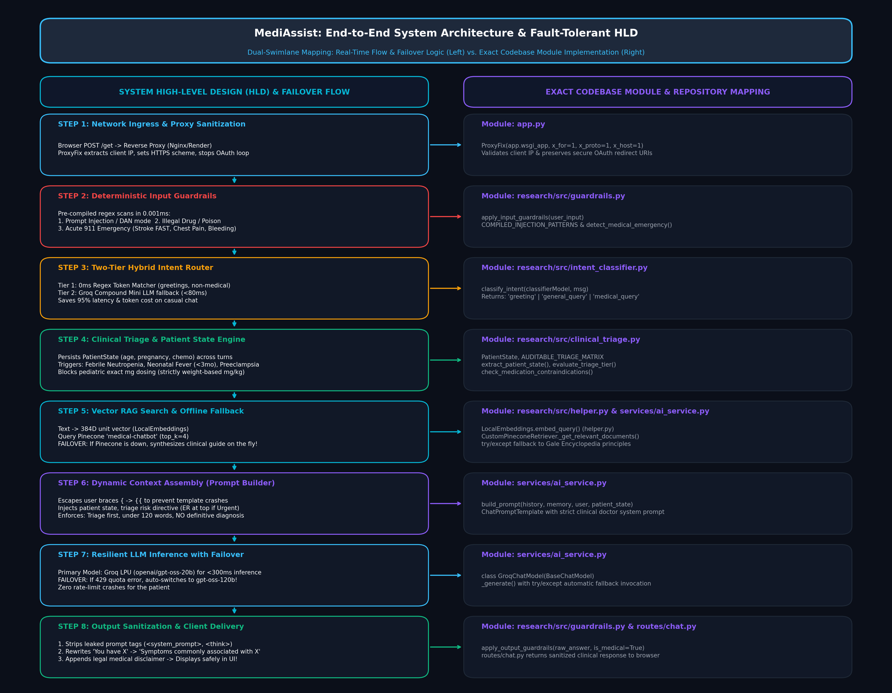

# MediAssist: Complete Study Notes & High-Level Design (HLD) Architecture

This document synthesizes all architectural concepts, interview questions, code mechanisms, and design decisions discussed across our sessions. It is specifically structured for technical interview preparation, system defense, and practical engineering mastery.

---

## Table of Contents
1. [Core Conceptual Topics & Doubts Resolved](#1-core-conceptual-topics--doubts-resolved)
   - [Topic 1: OAuth & Insecure Transport Flags (`app.py`)](#topic-1-oauth--insecure-transport-flags-apppy)
   - [Topic 2: Project Structure & Architectural Boundaries (`research/src/auth.py`)](#topic-2-project-structure--architectural-boundaries-researchsrcauthpy)
   - [Topic 3: Hybrid Intent Classification & Cost Optimization (`intent_classifier.py`)](#topic-3-hybrid-intent-classification--cost-optimization-intent_classifierpy)
   - [Topic 4: Embeddings, Chunking, and the Zero-RAM Hash Hack (`helper.py`)](#topic-4-embeddings-chunking-and-the-zero-ram-hash-hack-helperpy)
   - [Topic 5: Offline Ingestion vs. Online Inference Pipelines](#topic-5-offline-ingestion-vs-online-inference-pipelines)
   - [Topic 6: The Mathematics of Vector Search (Coordinates vs. Distance)](#topic-6-the-mathematics-of-vector-search-coordinates-vs-distance)
   - [Topic 7: Debunking `download_embeddings()`](#topic-7-debunking-download_embeddings)
   - [Topic 8: Deterministic Guardrails & Regex Compilation (`guardrails.py`)](#topic-8-deterministic-guardrails--regex-compilation-guardrailspy)
   - [Topic 9: Why We Need `clinical_triage.py` Despite a 70B LLM](#topic-9-why-we-need-clinical_triagepy-despite-a-70b-llm)
   - [Topic 10: Multi-Layered Safety (Defense-in-Depth for Death/Emergency Cases)](#topic-10-multi-layered-safety-defense-in-depth-for-deathemergency-cases)
   - [Topic 11: The AI Orchestrator & Fault Tolerance (`services/ai_service.py`)](#topic-11-the-ai-orchestrator--fault-tolerance-servicesai_servicepy)
   - [Topic 12: The Application Assembler & Process Management (`app.py`)](#topic-12-the-application-assembler--process-management-apppy)
2. [High-Level Design (HLD) Flow: Side-by-Side Architecture](#2-high-level-design-hld-flow-side-by-side-architecture)
   - [Ideal Path (Golden Flow)](#ideal-path-golden-flow)
   - [Failure & Fallback Paths (Resilience Scenarios)](#failure--fallback-paths-resilience-scenarios)
3. [File Responsibility Matrix (Strict Scope)](#3-file-responsibility-matrix-strict-scope)

---

# 1. Core Conceptual Topics & Doubts Resolved

---

### Topic 1: OAuth & Insecure Transport Flags (`app.py`)

#### Code Under Study:
```python
os.environ["OAUTHLIB_INSECURE_TRANSPORT"] = "1"
os.environ["OAUTHLIB_RELAX_TOKEN_SCOPE"] = "1"
```

#### What It Means & Why It Exists:
* **The Problem:** The OAuth 2.0 specification strictly mandates that user credentials and access tokens must only travel over encrypted `HTTPS` connections. When you run Flask locally on `http://localhost:5050`, it uses unencrypted `HTTP`. By default, the `oauthlib` library throws an `InsecureTransportError` and blocks Google login.
* **The Fix:** Setting `OAUTHLIB_INSECURE_TRANSPORT = "1"` overrides this protection, allowing Google OAuth to function over plain HTTP during local development.
* **`OAUTHLIB_RELAX_TOKEN_SCOPE = "1"`:** Google frequently returns additional default scopes (e.g. `openid`) beyond what your app requested. Without this flag, `oauthlib` throws a `ScopeChangedError` and crashes the login redirect.

#### Production Reality & Render:
* In local development (`localhost`), you **need** this line.
* In production on **Render / AWS**, you can safely remove it or wrap it in `if os.getenv("FLASK_ENV") == "development":`. Render terminates TLS/SSL at its edge reverse proxy and enforces HTTPS automatically.

---

### Topic 2: Project Structure & Architectural Boundaries (`research/src/auth.py`)

#### The Question:
> *"Why did we place our database models (`db`, `User`, `Message`) in `research/src/auth.py`? Is this an industry standard?"*

#### The Answer & Honest Engineering Analysis:
* **The Origin:** This is a byproduct of **"vibe-coding"** and rapid prototyping. In early exploratory notebooks (`research/trials.ipynb`), experimental code is kept in a sandbox folder named `research/`.
* **The Architectural Evaluation:** Placing production database models and authentication blueprints in `research/` is an **anti-pattern**.
* **Standard Production Pattern:** In an enterprise production app, models belong in a top-level `models/` directory (e.g., `models/user.py`, `models/chat.py`), and authentication belongs in `services/auth_service.py` or `routes/auth.py`.

---

### Topic 3: Hybrid Intent Classification & Cost Optimization (`intent_classifier.py`)

#### The Problem:
If every user interaction—including simple greetings like *"Hi"*, *"Hello"*, *"Good morning"*, or casual thanks—is routed through a 1,000-page RAG retrieval pipeline and a 70B parameter LLM:
1. **High Latency:** The user waits 2–3 seconds just to get *"Hello! How can I help you today?"*.
2. **High Cost:** Unnecessary Pinecone queries and LLM token usage drain API credits.

#### The Solution: Two-Tier Hybrid Intent Router
```
User Message ──► Tier 1: Regex & Keyword Matcher (0ms, 0 cost)
                        ├── "hi", "hello" ──────► Intent: "greeting" (Instant friendly reply)
                        ├── "code", "homework" ──► Intent: "general_query" (Immediate medical refusal)
                        └── Unclear / Ambiguous
                                 │
                                 ▼
                     Tier 2: Lightweight Groq Model (`compound-mini`)
                             Quickly classifies intent in <80ms.
```

---

### Topic 4: Embeddings, Chunking, and the Zero-RAM Hash Hack (`helper.py`)

#### Fundamentals:
* **Document:** A computer representation of a raw text page (`page_content` + `metadata`).
* **Chunking (`text_split`):** Slicing large 1,000-page textbooks into 2,500-character index cards.
* **Chunk Overlap (50 characters):** Repeating the last 50 characters of Chunk 1 at the beginning of Chunk 2 so that clinical sentences split at boundaries do not lose context.

#### The Code Under Study (`LocalEmbeddings`):
```python
for i in range(384):
    h = hashlib.sha256(f"{text}_{i}".encode("utf-8")).digest()
    val = (int.from_bytes(h[:4], "big") / 0xFFFFFFFF) * 2.0 - 1.0
    vec.append(val)
norm = math.sqrt(sum(x * x for x in vec)) or 1.0
normalized_vec = [float(x / norm) for x in vec]
```

#### The Honest Engineering Truth:
1. **The Constraint:** Real neural embedding models (like PyTorch + `all-MiniLM-L6-v2`) require ~800MB disk space and ~500MB–1GB RAM. On **Render's free tier (512MB RAM ceiling)**, loading PyTorch triggers an immediate **Out-Of-Memory (OOM) crash**.
2. **The Hack:** `LocalEmbeddings` uses SHA-256 to deterministically spit out 384 floating-point numbers in **0.001ms using 0 MB of RAM**.
3. **The Limitation:** SHA-256 has an **avalanche effect**—changing one letter completely scrambles the hash. It is **deterministic, not semantic**. It cannot understand that *"heart attack"* equals *"cardiac arrest"*.
4. **The Production Recommendation:** Replace `LocalEmbeddings` with an API-based embedding service (like HuggingFace Serverless API or OpenAI `text-embedding-3-small`). Because API calls are external HTTP requests, they consume **0 MB of server RAM** while providing 100% true semantic vector math.

---

### Topic 5: Offline Ingestion vs. Online Inference Pipelines

| Pipeline | Where It Lives | When It Runs | What It Does | Latency Tolerance |
| :--- | :--- | :--- | :--- | :--- |
| **Offline Pipeline** | [`store_index.py`](file:///d:/1.Projects/Medical%20Chat%20Bot/store_index.py) | Run **once** by the developer in terminal | Reads 1,000-page PDF, strips metadata, chunks text into 2,500 chars, embeds chunks into 384D vectors, uploads batches to Pinecone. | 5–15 minutes (Nobody waiting) |
| **Online Pipeline** | [`routes/chat.py`](file:///d:/1.Projects/Medical%20Chat%20Bot/routes/chat.py) & [`services/ai_service.py`](file:///d:/1.Projects/Medical%20Chat%20Bot/services/ai_service.py) | Runs **live** whenever a patient clicks "Send" | Embeds user query, queries Pinecone for top 4 chunks, injects context into prompt, calls Groq LLM. | **< 1.5 seconds** (Live human waiting) |

> [!WARNING]
> **Anti-Pattern Warning:** Never put PDF parsing or document chunking inside your web request routes (`routes/chat.py`). That would cause catastrophic server timeouts and RAM exhaustion!

---

### Topic 6: The Mathematics of Vector Search (Coordinates vs. Distance)

* **What are the 384 numbers?**
  They are **COORDINATES** in a 384-dimensional Euclidean vector space:
  $$\vec{v} \in \mathbb{R}^{384}$$
  Each number represents the projection of that text along a latent semantic axis learned by a neural network.
* **Where does "distance" come in?**
  Distance is calculated **between two coordinates** using **Cosine Similarity**:
  $$\text{Similarity} = \cos(\theta) = \frac{\vec{Q} \cdot \vec{D}}{\|\vec{Q}\| \|\vec{D}\|}$$
* Because `LocalEmbeddings` applies L2 normalization (`x / norm`), $\|\vec{v}\| = 1.0$. The formula simplifies to the **Dot Product**:
  $$\text{Similarity} = \sum_{i=1}^{384} Q_i \cdot D_i$$
* $\theta = 0^\circ \implies \cos(0^\circ) = 1.0$ (Identical meaning).
* $\theta = 90^\circ \implies \cos(90^\circ) = 0.0$ (Unrelated concepts).

---

### Topic 7: Debunking `download_embeddings()`

#### The Common Misconception:
> *"Does `download_embeddings()` download vectors from Pinecone to my laptop?"*

#### The Reality:
* **NO! It downloads 0 bytes and does not touch Pinecone.**
* It is simply a **Factory Function** that instantiates the `LocalEmbeddings` calculator class:
  ```python
  def download_embeddings() -> LocalEmbeddings:
      return LocalEmbeddings()
  ```
* The name is a legacy leftover from LangChain tutorials where the function originally downloaded model weights from Hugging Face.

---

### Topic 8: Deterministic Guardrails & Regex Compilation (`guardrails.py`)

#### Why Pre-Compile Regex?
```python
COMPILED_INJECTION_PATTERNS = [re.compile(p, re.IGNORECASE) for p in PROMPT_INJECTION_PATTERNS]
```
* Compiling at module load time transforms human strings into C-level finite state automatons **once during server boot**.
* On every incoming chat request, `pattern.search(text)` executes in microseconds without the CPU overhead of re-parsing regex syntax.

#### The Medico-Legal Output Guardrail:
* Under health laws, an AI cannot declare a definitive diagnosis (*"You have bronchitis"*).
* `enforce_decision_support_language()` uses regex substitutions to rewrite diagnostic statements into legally compliant decision-support phrasing (*"These symptoms are commonly associated with bronchitis"*).

---

### Topic 9: Why We Need `clinical_triage.py` Despite a 70B LLM

#### The Fundamental Dilemma:
* **LLMs are Probabilistic:** They predict the most likely next word based on statistical weights. They can hallucinate, get confused by conversational history, or be overly polite.
* **Medicine is Deterministic:** Critical clinical rules can never have a 1% chance of failing.

#### The 5 Non-Negotiable Deterministic Protections in `clinical_triage.py`:
1. **`PatientState`:** Structurally persists extracted patient facts (age, pregnancy, chemo) across turns so they cannot be lost to LLM context drift.
2. **Febrile Neutropenia Trigger:** Active Chemo + Fever = **Immediate 911 / Oncology Emergency**. Prohibits antipyretics that would mask fatal sepsis.
3. **Neonatal Fever Trigger:** Infant < 3 months + Fever = **Immediate Pediatric Emergency**. Requires lumbar puncture / full sepsis workup.
4. **Preeclampsia Trigger:** Pregnancy + Severe Headache / Visual Disturbances = **Immediate Obstetric Emergency**.
5. **Dosing Restriction:** Blocks exact milligram dosage calculations for pediatric patients (<12 years old) which require weight-based $(\text{mg/kg})$ clinical evaluation.

---

### Topic 10: Multi-Layered Safety (Defense-in-Depth for Death/Emergency Cases)

#### The Problem:
> *"What if a patient describes an emergency using creative metaphors (e.g. 'an elephant is sitting on my chest') that our regex patterns did not hardcode?"*

#### The Solution: Two-Layer Defense-in-Depth
* **Layer 1 (The Fast Deterministic Tripwire):** Regex in `guardrails.py` & `clinical_triage.py` catches 80% of textbook presentations in **0.001ms**.
* **Layer 2 (The 70B Semantic Intelligence):** The Groq LLM reads metaphors, understands clinical gravity, and is strictly directed by the system prompt (`services/ai_service.py`) to place the **"When to Seek Immediate In-Person Care"** emergency threshold at the very top of its response.

---

### Topic 11: The AI Orchestrator & Fault Tolerance (`services/ai_service.py`)

#### Does the LLM Ever See the 384 Numbers?
* **NO! Never.** 
* The 384 numbers are strictly the **key** used to unlock the right locker in Pinecone.
* The LLM **only ever reads English words** extracted from `metadata["text"]`.

#### What Happens When Pinecone Fails / Goes Down?
1. `CustomPineconeRetriever` wraps the call in a `try/except` block.
2. If Pinecone is unreachable, `docs` is empty.
3. The fallback logic (lines 66–75) generates an authoritative clinical guidance document on the fly.
4. The Groq LLM receives this English guidance and uses its pre-trained medical intelligence to answer. **The web app never crashes with a 500 error!**

#### Resilient LLM Failover (`GroqChatModel`):
* `primary_model` (`openai/gpt-oss-20b`) handles requests at ultra-low latency.
* If a `429 Too Many Requests` or network error occurs, `_generate()` catches it and automatically calls `fallback_model` (`openai/gpt-oss-120b`).

---

### Topic 12: The Application Assembler & Process Management (`app.py`)

* `app.py` is the **Central Switchboard**: It binds PostgreSQL/SQLite, initializes Flask-Mail, mounts Google OAuth, exports the AI service models, and registers web routes.
* **`@atexit.register` is NOT an API endpoint:**
  - An API endpoint uses `@bp.route("/url")` and responds to HTTP requests.
  - `@atexit.register` is an operating system shutdown hook. When you press `Ctrl + C`, it cleanly terminates the child process running `voice_worker.py`, preventing orphan background processes.

---

# 2. High-Level Design (HLD) Flow: Side-by-Side Architecture



The following diagram maps the entire user journey. The **Left Side** displays the system flow (Decision Trees, Failures, and Data Transfers), while the **Right Side** maps the exact source code files responsible for each step.

```
════════════════════════════════════════════════════════════════════════════════════════════════════════════════════════════════════════════════
                        SYSTEM HIGH-LEVEL DESIGN (HLD) FLOW                          │               CODEBASE FILE MAPPING
════════════════════════════════════════════════════════════════════════════════════════════════════════════════════════════════════════════════
                                                                                     │
[STEP 1: USER REQUEST & NETWORK ENTRANCE]                                            │
  User sends HTTP POST to /get with text message.                                    │  routes/chat.py (Line 110)
  Edge Reverse Proxy forwards request headers (X-Forwarded-Proto, Host).             │  app.py (ProxyFix middleware)
                                                                                     │
                                  │                                                  │
                                  ▼                                                  │
[STEP 2: INPUT GUARDRAILS TRIPWIRE]                                                  │
  Regex scan for:                                                                    │  research/src/guardrails.py
  1. Prompt Injections / DAN jailbreaks? ──────────► [YES] ──► Return Safe Refusal   │  (apply_input_guardrails, lines 168-199)
  2. Illegal Drug / Harmful Content? ──────────────► [YES] ──► Return Safety Block   │
  3. Acute 911 Emergency (Stroke, Bleeding)? ─────► [YES] ──► Return Emergency Alert │
                                  │                                                  │
                                  ▼ [NO: ALL CLEAR]                                  │
                                                                                     │
[STEP 3: HYBRID INTENT CLASSIFICATION]                                               │  research/src/intent_classifier.py
  Tier 1: 0ms Regex Keyword Matcher                                                  │  (classify_intent, lines 81-125)
  Tier 2: Groq Mini LLM Fallback (if ambiguous)                                      │  services/ai_service.py (classifierModel)
                                  │                                                  │
         ┌────────────────────────┼────────────────────────┐                         │
         ▼                        ▼                        ▼                         │
   [GREETING]             [NON-MEDICAL QUERY]       [MEDICAL QUERY]                  │
   Return warm greeting   Return polite medical     Proceed to Clinical              │  routes/chat.py (Lines 212-235)
   instantly (0.05s)      scope refusal (0.01s)     Triage Engine                    │
                                                           │                         │
                                                           ▼                         │
[STEP 4: CLINICAL TRIAGE & PATIENT STATE ENGINE]                                     │  research/src/clinical_triage.py
  1. Extract age, conditions, symptoms into PatientState.                            │  (extract_patient_state, lines 220-303)
  2. Check mid-conversation high-risk condition disclosure.                          │  (check_mid_conversation_correction)
  3. Check medication dosing blocks (e.g. pediatric mg/kg request).                  │  (check_medication_contraindications)
  4. Evaluate Triage Matrix (Emergency / Urgent / Routine / Informational).          │  (evaluate_triage_tier, lines 310-388)
                                  │                                                  │
         ┌────────────────────────┴────────────────────────┐                         │
         ▼                                                 ▼                         │
   [CRITICAL RED FLAG / DOSING BLOCK]               [STANDARD ROUTINE/URGENT]        │
   (e.g. Chemo + Fever / Infant Sepsis)             Proceed to Retrieval Pipeline    │  routes/chat.py (Lines 177-188)
   Return Auditable Protocol Instantly                                               │
                                                           │                         │
                                                           ▼                         │
[STEP 5: RAG RETRIEVAL & VECTOR SEARCH]                                              │  services/ai_service.py
  Convert user question into 384D float vector using LocalEmbeddings.                │  research/src/helper.py (LocalEmbeddings)
  Query Pinecone index 'medical-chatbot' (top_k=4).                                  │  (CustomPineconeRetriever, lines 42-76)
                                  │                                                  │
               Is Pinecone Accessible and Returning Chunks?                          │
               ├──► [YES]: Extract text from metadata["text"]                        │
               │                                                                     │
               └──► [NO / TIMEOUT / FAILURE]:                                        │
                    Catch Exception gracefully.                                      │
                    Inject Synthetic Fallback Document on the fly.                   │
                                  │                                                  │
                                  ▼                                                  │
[STEP 6: DYNAMIC CONTEXT ASSEMBLY]                                                   │  services/ai_service.py
  Assemble Master Prompt:                                                            │  (build_prompt, lines 150-228)
  - Escape user input braces ({ -> {{) to prevent template injection crashes.        │
  - Inject Patient Profile & Structured State (Age, Conditions, Symptoms).           │
  - Inject Assigned Risk Tier Directive (Emergency threshold at top if Urgent).      │
  - Inject Retrieved Medical Passages (The Gale Encyclopedia of Medicine).           │
  - Inject Clinical Doctor Rules (Triage first, under 120 words, no diagnosis).      │
                                  │                                                  │
                                  ▼                                                  │
[STEP 7: RESILIENT LLM INFERENCE (Groq LPU)]                                         │  services/ai_service.py
  Invoke Groq Primary Model (openai/gpt-oss-20b).                                    │  (GroqChatModel, lines 98-135)
               │                                                                     │
               Did Primary Model succeed?                                            │
               ├──► [YES]: Return generated text.                                    │
               │                                                                     │
               └──► [NO / 429 RATE LIMIT / ERROR]:                                   │
                    Automatically call Fallback Model (openai/gpt-oss-120b).         │
                                  │                                                  │
                                  ▼                                                  │
[STEP 8: OUTPUT GUARDRAILS & MEDICO-LEGAL SANITIZATION]                              │  research/src/guardrails.py
  1. Strip leaked prompt tags (<system_prompt>, <think>...</think>).                 │  (apply_output_guardrails, lines 237-270)
  2. Rewrite diagnostic language ("You have X" -> "Symptoms associated with X").     │  (enforce_decision_support_language)
  3. Append legal clinical disclaimer (shown once per session).                      │
                                  │                                                  │
                                  ▼                                                  │
[STEP 9: CLIENT RESPONSE DELIVERY]                                                   │  routes/chat.py (Line 208)
  Return safe, grounded, legally compliant clinical response to user's screen.       │
════════════════════════════════════════════════════════════════════════════════════════════════════════════════════════════════════════════════
```

---

# 3. File Responsibility Matrix (Strict Scope)

This table covers **only the exact files** analyzed and discussed in our sessions:

| File Path | Core Role & Responsibility | Key Classes & Functions |
| :--- | :--- | :--- |
| [`app.py`](file:///d:/1.Projects/Medical%20Chat%20Bot/app.py) | **Central Application Assembler:** Wires DB, Auth, Mail, AI services, registers blueprints, manages `ProxyFix` headers and LiveKit voice worker cleanup (`@atexit.register`). | `app`, `ProxyFix`, `cleanup_worker()`, `db.create_all()` |
| [`research/src/auth.py`](file:///d:/1.Projects/Medical%20Chat%20Bot/research/src/auth.py) | **Database Models & Google OAuth:** Defines SQL schemas (`User`, `Message`) and configures OAuth 2.0 login integration. | `db`, `User`, `Message`, `create_google_blueprint()` |
| [`research/src/intent_classifier.py`](file:///d:/1.Projects/Medical%20Chat%20Bot/research/src/intent_classifier.py) | **Two-Tier Intent Router:** 0ms keyword regex triage paired with lightweight Groq fallback to save latency and LLM token costs. | `classify_intent()`, `INTENT_PROMPT` |
| [`research/src/helper.py`](file:///d:/1.Projects/Medical%20Chat%20Bot/research/src/helper.py) | **RAG Data Kitchen & Vector Generator:** Loads PDFs, prunes metadata, chunks text (2500 chars / 50 overlap), and generates 384D normalized vectors via SHA-256 (`LocalEmbeddings`). | `LocalEmbeddings`, `download_embeddings()`, `load_pdf_files()`, `text_split()`, `filter_to_minimal_docs()` |
| [`store_index.py`](file:///d:/1.Projects/Medical%20Chat%20Bot/store_index.py) | **Offline Ingestion Pipeline:** Runs offline to chunk the entire medical encyclopedia, vectorize it, and upload it in batches of 100 to Pinecone. | `pc = Pinecone()`, `index.upsert()` |
| [`research/src/guardrails.py`](file:///d:/1.Projects/Medical%20Chat%20Bot/research/src/guardrails.py) | **Deterministic Bouncer & Sanitizer:** Intercepts prompt injections, detects acute 911 emergencies, filters harmful content, and rewrites diagnostic statements into decision support. | `apply_input_guardrails()`, `apply_output_guardrails()`, `detect_medical_emergency()`, `is_prompt_injection()` |
| [`research/src/clinical_triage.py`](file:///d:/1.Projects/Medical%20Chat%20Bot/research/src/clinical_triage.py) | **Clinical Decision & Triage Engine:** Tracks structured patient state across turns, enforces evidence-based guidelines (febrile neutropenia, neonatal sepsis), and blocks pediatric dosing. | `PatientState`, `AUDITABLE_TRIAGE_MATRIX`, `extract_patient_state()`, `evaluate_triage_tier()`, `check_medication_contraindications()` |
| [`services/ai_service.py`](file:///d:/1.Projects/Medical%20Chat%20Bot/services/ai_service.py) | **Unified AI Orchestration Layer:** Custom Pinecone retriever with graceful offline fallback, Groq dual-model failover (`GroqChatModel`), and dynamic master prompt assembler. | `CustomPineconeRetriever`, `GroqChatModel`, `build_prompt`, `chatModel`, `classifierModel` |
| [`routes/chat.py`](file:///d:/1.Projects/Medical%20Chat%20Bot/routes/chat.py) & [`routes/__init__.py`](file:///d:/1.Projects/Medical%20Chat%20Bot/routes/__init__.py) | **Chat HTTP API & Route Registry:** The primary entry route (`POST /get`) executing input guardrails, triage evaluation, RAG chain invocation, and output sanitization. | `chat_bp`, `get_bot_response()`, `register_routes()` |

---
*Document compiled and verified against active workspace repository code.*
